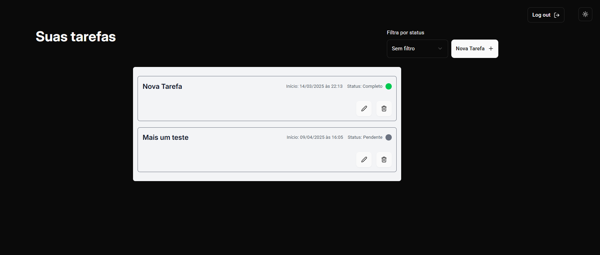

# 📕 Gerenciamento de Tarefas - Teste Prático



## 📌 Descrição Geral

Este projeto é um sistema de gerenciamento de tarefas, criado como parte do teste prático para desenvolvedor júnior. Ele contém tanto a parte do backend quanto do frontend.

## ⚙️ Tecnologias Utilizadas

### 🖥️ **Frontend (Web)**
- **[React](https://react.dev/)** com **[Vite](https://vite.dev/)**
- **[TypeScript](https://www.typescriptlang.org/)**
- **[Tailwindcss](https://tailwindcss.com/)** para estilização
- **[React Hook Form](https://react-hook-form.com/)** para gerenciamento de formulários
- **[Zod](https://zod.dev/)** para validação de formulários
- **[Shadcn/ui](https://ui.shadcn.com/)** biblioteca de componentes
- **[React Query](https://tanstack.com/query/latest)** para requisições e cache de dados
- **[React Router](https://reactrouter.com/)** para navegação
- **[Sonner](https://github.com/emilkowalski/sonner)** 
- **[Vitest](https://vitest.dev/)** para os testes

### 🖥️ **Backend (API)**
- **[Node.js](https://nodejs.org/)** com **[NestJS](https://nestjs.com/)**
- **[Prisma ORM](https://www.prisma.io/)** para acesso ao banco de dados
- **[PostgreSQL](https://www.postgresql.org/)** como banco de dados
- **[Docker](https://www.docker.com/)** para rodar o PostgreSQL e o backend
- **[Jest](https://jestjs.io/)** para os testes

## 🚀 **Como Rodar o Projeto**

## 🔹 **1. Clonar o repositório**
```sh
git clone https://github.com/marcos-dev14/Task-Management.git
cd Task-Management
```
## **Configuração do backend**

1. **Navegue até o diretório do server:**
  ```sh
  cd .\server
  ```

2. **Copie o arquivo `.env.example` para `.env` e configure as variáveis de ambiente:**
  ```sh
  cp .env-example .env
  ```

3. **Suba o banco de dados com Docker:**
  ```sh
  docker-compose up -d
  ```

4. **Instale as dependências:**
  ```sh
  npm install
  ```

5. **Execute as migrações do Prisma:**
  ```sh
  npx prisma migrate dev
  ```

6. **Inicie o servidor:**
  ```sh
  npm run start ou npm run start:dev
  ```

## **Configuração do frontend**

1. **Navegue até o diretório do web:**
  ```sh
  cd ..\web\
  ```

2. **Copie o arquivo `.env.example` para `.env` e configure as variáveis de ambiente com endereço da api:**
  ```sh
  cp .env-example .env
  ```

3. **Instale as dependências:**
  ```sh
  npm install
  ```

4. **Inicie o projeto web:**
  ```sh
  npm run dev
  ```
